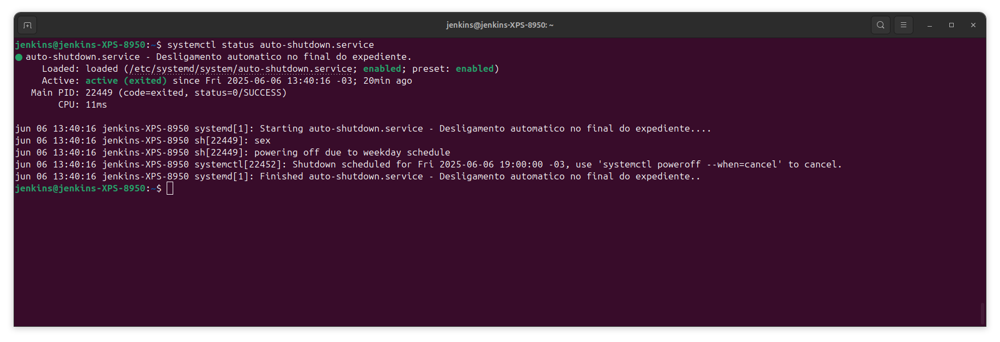

# Desligamento automático em horário de semana e final de semana

Este pc está configurado com um serviço do 'systemd' para enviar um comando ao systemd agendando o desligamento da máquina no horário correto.

O serviço do systemd em questão executa um comando específico no momento da inicialização da máquina, que por sua vez agenda o desligamento para 19:00 ou 8:00 a depender do dia da semana que o script foi executado.

O systemd é um gerenciador de serviços do linux.

O comando
`systemctl status auto-shutdown.service`
mostrará o status atual do serviço, e mostrará o horário que o serviço está agendado para o dia atual.
Exemplo:




O serviço é um arquivo de texto escrito no seguinte caminho.

` /etc/systemd/system/auto-shutdown.service `

Esse servico chama um script localizado em:

` /home/jenkins/auto-shutdown/script.sh `

Abaixo segue exemplo do script:

```sh
    #!/bin/sh
    today=$(date +%a)
    echo $today

    if [ $today = "dom" -o $today = "sab" ]; then
        echo 'powering off due to weekend schedule';
        systemctl poweroff --when=8:00:00;
        exit 0
    else
        echo "powering off due to weekday schedule";
        systemctl poweroff --when=19:00:00
        exit 0
    fi
    exit 1
```

Caso o dia da semana atual seja "sab" (sabado) ou "dom" (domingo)

o script envia o comando ` systemctl poweroff --when=8:00 `

Agendando o desligamento automático no horário das 8hrs da manhã.

Caso contrário, signifca que estamos em dia de semana, e o agendamento será feito para 7hrs da noite.

# Atualizando o horário
Se for necessário mudar o horário de desligamento basta alterar o script que segue o padrão [systemd.time](https://www.freedesktop.org/software/systemd/man/latest/systemd.time.html)

Após qualquer alteração no script ou no serviço é necessário reinciar o daemon com o comando:
`sytemctl daemon-reload ` para que as alterações entrem em vigor.

Em casos de falha do serviço ele entrará em status inativo até que o pc reinicie, ao reiniciar o systemd tentará executar o serviço novamente.
Os logs do script executado pelo serviço podem ser vistos com o comando `systemctl status autoshutdown.service `.

Em caso de falha do serviço e não do script o erro poderá ser visto tanto no status do serviço, ou com mais informações com o comando.
` journalctl -xeu auto-shutdown.service `

Para parar totalmente o serviço de ser executado, inibindo o agendamento do desligamento da máquina permanentemente utilize o comando:

`systemctl disable auto-shutdown.service`

Isso evitará que o comando seja iniciado automático junto com a máquina.

Entretando, o agendamento já está feito e a máquina irá desligar no horário configurado.

Para cancelar o agendamento, impedindo que a máquina desligue no horário, utilize o comando:

` systemctl poweroff --when=cancel `

Isto irá cancelar o agendamento atual. Este comando pode ser executado livremente, mesmo que o serviço esteja em execução.
Esse comando simplemente fará com que o agendamento atual seja cancelado, e ao reiniciar a máquima, um novo agendamento será feito, com base na hora e dia atual.

Para reativar o serviço, em caso de ter desabilitado ele anteriormente, utilize o comando:

` systemctl enable auto-shutdown.service `


Conteudo do wrapper.

```
[Unit]
Description=Desligamento automatico no final do expediente.

[Service]
Type=oneshot
ExecStart=/bin/sh /home/jenkins/auto-shutdown/script.sh
RemainAfterExit=yes

[Install]
WantedBy=multi-user.target

```
